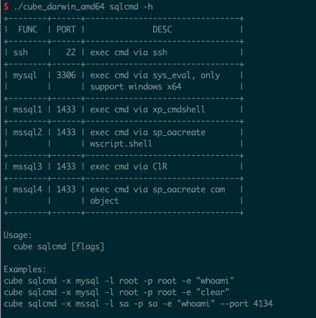

## 声明
>特别声明：此工具仅限于安全研究，禁止使用该项目进行违法操作，否则自行承担相关责任

## 特点
- 方便二次开发，快速增加插件
- 支持输出结果到excel文档
- 精简运行参数，方便记忆

## 一把梭
如果没有耐心看下面的命令选项，运行如下命令，然后打开pwn.xlsx，最终结果会以IP纬度聚合展示：
```
cube crack -x X -s 192.168.2.1/24 -o /tmp/pwn.xlsx
cube probe -x Y -s 192.168.2.1/24 -o /tmp/pwn.xlsx
```


## 全局参数
- `-v`: 输出内容更详细，一般用于调试
- `-n`: 设定`crack`和`probe`模块的运行线程数量，默认30线程
- `--delay`: 设定此选项的时候，`crack`和`probe`模块强制设为单线程，并在设定的值之内随机休眠(~~毫无卵用~~)


## 0x1. crack模块
#### 使用内置词典
```shell
cube crack -s 192.168.1.1 -x ssh
```
#### 指定用户密码
```shell
cube crack -l root,ubuntu -p 123,000111,root -x ssh -s 192.168.1.1
cube crack -L user.txt -P pass.txt -s 192.168.1.1/24 -x ssh
cube crack -l root -P pass.txt -s 192.168.1.1/24 -x ssh
```
#### 指定端口
```shell
cube crack -l root -p root -s 192.168.1.1 -x ssh --port 2222
```
#### 指定多个插件
```shell
# 爆破mysql和ssh(注意ssh和mysql之间的逗号不存在空格)
cube crack -s 192.168.1.1 -x ssh,mysql
```
#### 爆破phpmyadmin(不可与其它插件组合)
```shell
cube crack -s http://192.168.2.1 -x phpmyadmin
```

#### 加载全部爆破插件
```shell
cube crack -x X -s 192.168.1.1
```

* phpmyadmin这类http的爆破插件只能单独使用，不可与其它插件同时加载，类似的插件有: `httpbasic/jenkins/phpmyadmin/zabbix`
* `-x X`是加载全部可用的爆破插件，先检查端口，端口开放之后爆破
* 未指定用户密码的时候，会加载内置词典
* `zabbix`插件没有卵用，爆破5次失败之后会锁定30s

#### 支持的爆破插件
* 可组合使用: `elastic/ftp/mongo/mssql/mysql/postgres/redis/smb/ssh`
* 不可组合使用： `httpbasic/jenkins/phpmyadmin/zabbix`

## 0x2. probe模块
#### 加载全部默认插件
```shell
# -x Y的时候加载全部probe插件， -x -X只会加载部分默认插件
cube probe -x X -s 192.168.2.1/24
cube probe -x Y -s 192.168.2.1/24
```
### 加载指定插件
```shell
cube probe -x oxid,ms17010 -s 192.168.2.1/24
```

#### 支持的探测插件
| FUNC      | PORT  | LOAD BY X |
|-----------|-------|-----------|
| docker    |  2375 | Y         |
| dubbo     | 20880 | Y         |
| etcd      |  2379 | Y         |
| k8s       | 10255 | Y         |
| ms17010   |   445 | Y         |
| mssql     |  1433 | N         |
| netbios   |   137 | N         |
| oxid      |   135 | Y         |
| ping      |       | N         |
| rmi       |  1099 | Y         |
| smb       |   445 | Y         |
| smbghost  |   445 | Y         |
| winrm     |  5985 | N         |
| wmi       |   135 | N         |
| zookeeper |  2181 | Y         |
| jboss     |  3873 | Y         |

* `smb/wmi/winrm/mssql`是利用NTLM认证过程获取[Windows版本系统信息](https://jkme.github.io/2021/08/06/windows-ntlm-smb-scan.html)
* 使用`ping/netbios`的时候，最好单独使用获取更准确的结果，线程数量建议为10
* `Load By X`: 是指`cube probe -x X -s 192.168.2.1/24`的时候，`-x X`是否需要加载的插件

## 0x3. 结果输出
在使用`crack`和`probe`模块的任何插件都可以加上`-o result.xlsx`，用于把结果写入到excel，当excel已经存在
的时候，cube会把当前扫描的结果自动追加到文档，建议扫描结束之后的文档固定首行首列，查看更方便。

## 0x4. 快速开发
#### Crack模块
Crack模块可以抽象为一个爆破的框架，当需要爆破的插件不在Cube可用插件列表里面，可以使用go快速开发爆破插件。
`crack`模块下的命令参数同样适用新增的插件，比如`-l/-L，-p/-P，--port`。 比如新增一个自定义爆破插件，插件名是`cloud`，默认端口`8080`，爆破的默认密码使用内置的`config.PASSWORDS`，插件需要实现`crack`模块的以下接口：
```shell
	CrackName() string       //插件名称
	CrackPort() string       //插件默认端口
	CrackAuthUser() []string //插件默认爆破的用户名
	CrackAuthPass() []string //插件默认爆破的密码，可以使用config.PASSWORD
	IsMutex() bool           //是否是只能单独使用的插件，比如爆破phpmyadmin类的http插件，当然elastic是个例外
	CrackPortCheck() bool    //是否需要端口检查，TCP协议设置为true，phpmyadmin单独使用的插件和UDP协议类的跳过端口检测，设置为false
	Exec() CrackResult       //爆破插件的具体实现
```


 * 如果需要`-x X`加载`cloud`, 修改`config/config.go`，把`cloud`加入到`CrackX`列表里面

#### Probe模块
同样新增Probe插件和crack类似，也可以看作信息收集的框架，新增的插件需要实现以下接口:

```shell
	ProbeName() string      //插件名称
	ProbePort() string      //插件默认端口
	PortCheck() bool        //是否需要端口检查
	ProbeExec() ProbeResult //执行插件
```

## 0x5 Sqlcmd模块
用于mysql的UDF提权(暂时支持windows x64)，mssql命令执行：
```shell
#开启UDF执行命令
cube sqlcmd -x mysql -l root -p root -e "whoami"

#清除xp_cmdshell
cube sqlcmd -x mysql -l root -p root -e "clear"

#指定mssql端口
cube sqlcmd -x mssql -l sa -p sa -e "whoami" --port 4134
```
#### 可用插件



### 参考
* [X-Crack](https://github.com/netxfly/x-crack)
* [LadonGo](https://github.com/k8gege/LadonGo)
* [fscan](https://github.com/shadow1ng/fscan)
* [gobuster](https://github.com/OJ/gobuster)
* [sqltool](https://github.com/mabangde/pentesttools/blob/master/golang/sqltool.go)
* [F-Scrack](https://github.com/y1ng1996/F-Scrack)

## TODO
* [数据库利用工具](http://ryze-t.com/posts/2022/02/16/%E6%95%B0%E6%8D%AE%E5%BA%93%E8%BF%9E%E6%8E%A5%E5%88%A9%E7%94%A8%E5%B7%A5%E5%85%B7-Sylas.html)
* [MDUT](https://github.com/SafeGroceryStore/MDUT)
* 完成SQLCMD模块
```
  -m ls  <dst path>
  -m cat <dst file>
  -m upload <src path> <dst path>
  -m exec <cmd string>
```

```shell
cube sqlcmd -s 127.0.0.1 -l root -p root -x mssql exec "whoami"
cube sqlcmd -s 127.0.0.1 -l root -p root -x mssql upload  <src> <dst>
cube sqlcmd -s 127.0.0.1 -l root -p root -x mssql ls  <src>
cube sqlcmd -s 127.0.0.1 -l root -p root -x mssql cat  <src> 
```
* [检查某个方法是否实现了接口](https://go.dev/play/p/tNNDukK4wRi)
